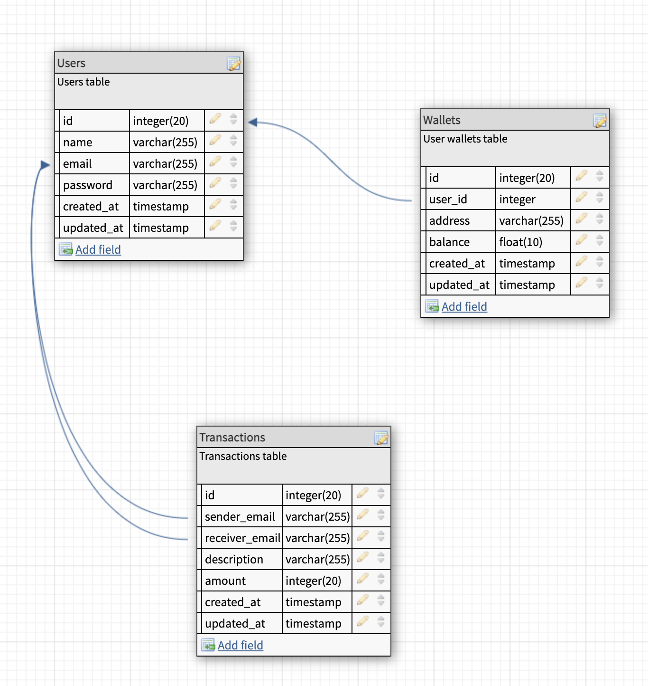

# Lendsqr Backend Test - Wallet Service API

This API provides a service for creating and managing virtual wallets. Users can create an account, login, and then perform various actions such as:

-   funding their accounts
-   transfering funds to other users
-   withdrawing funds from their virtual wallet

## Prerequisites

-   Node.js
-   TypeScript
-   Knex.js
-   MySQL database

## Installation

1. Clone this repository

```bash
git clone https://github.com/davydocsurg/lendsqr-backend-test.git
```

2. Navigate to the project directory:

```bash
cd lendsqr-backend-test
```

3. Install the dependencies:

```bash
npm install
```

4. Set up the database

Below is the E-R diagram of the database:


Here's the link to the [documentation](https://sqlspy.io/import_db_designer/c3B5LTM2MzY4NzctMjA5ODgwNjQ2M2IzMWExMC01OTA4MTA=)

-   Create a new database for the wallet service.
-   Run the following command in your project's root folder:

```bash
cp .env.example .env
```

P.S: The above command creates a `.env` file and populates it with the necessary environment variables.

-   Update the `.env` file with your database credentials.
-   Run the following command to create the necessary tables:

```bash
npm run migrate
```

## Running the API

1. Start the API server:

```bash
npm run dev
```

The API will be running at http://localhost:8080.

## Endpoints

### Prerequisites

-   An API testing tool like Postman

### POST /api/register

### Creates a new user account.

#### Request Body

```JSON
{
  "first_name": "John",
  "last_name": "Doe",
  "email": "doe@example.com",
  "password": "mypassword"
}
```

#### Response

-   On success: HTTP status 201

```JSON
{
    "success": true,
    "data": null,
    "message": "User created successfully"
}
```

### POST /api/login

### Logs in a user

#### Request Body

```JSON
{
    "email": "doe@example.com",
    "password": "mypassword"
}
```

#### Response

-   On success: HTTP status 200

```JSON
{
"success": true,
"data": {
    "token": "{{ AUTH_TOKEN }}",
    "user": {
        "id": 1,
        "first_name": "John",
        "last_name": "Doe",
        "email": "john@example.com",
        ...
    }
},
"message": "Login successful"
}
```

-   On error: HTTP status 401

```bash
{
    "error": {
        "errors": null,
        "statusCode": 401,
        "status": false,
        "details": "Invalid Credentials",
        "isOperationalError": true
    },
    ...
}
```

### POST /api/fund-my-wallet

### Fund logged in user's wallet

#### Request Authorization

```bash
Bearer Token: {{ AUTH_TOKEN }}
```

#### Request Body

```JSON
{
    "amount": 200
}
```

#### Response

On success: HTTP status 200

```bash
{
    "success": true,
    "message": "$200 has been added to your wallet. Your new balance is: $200"
}
```

### POST /api/transfer-funds

### Transfer funds from one user's account to another user's account.

#### Request Authorization

```bash
Bearer Token: {{ AUTH_TOKEN }}
```

#### Request Body

```bash
{
    "amount": 50,
    "receiver_email": "chibueze@example.com",
    "description": "Rent..."
}
```

#### Response

-   On success: HTTP status 200

```bash
{
    "success": true,
    "message": {
        "sender": "Your transaction was successful. $50 have been deducted from your wallet",
        "receiver": "$50 have been transfered to your wallet"
    }
}
```

-   On error: HTTP status 400

### POST /api/withdraw-funds

### Withdraw funds from a user's account.

#### Request Authorization

```bash
Bearer Token: {{ AUTH_TOKEN }}
```

#### Request Body

```bash
{
    "amount": 80
}
```

#### Response

-   On success: HTTP status 200

```bash
{
    "success": true,
    "message": "Debit Amount: $80. Your new balance is $120"
}
```

-   On error: HTTP status 400

### License

This API is released under the MIT License. See [LICENSE](https://chibueze.me) for details.
